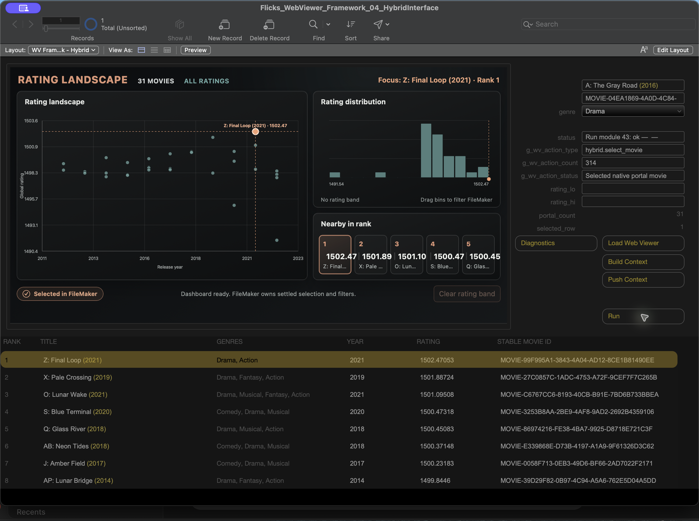
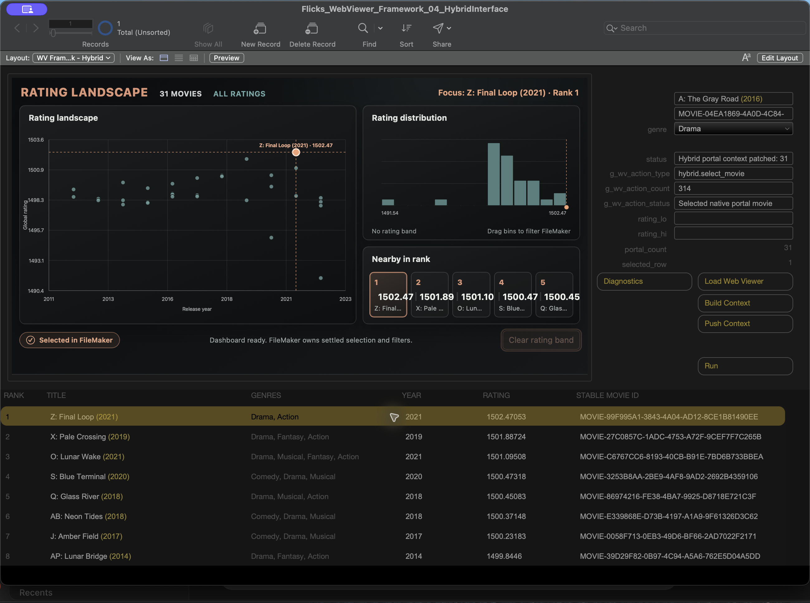
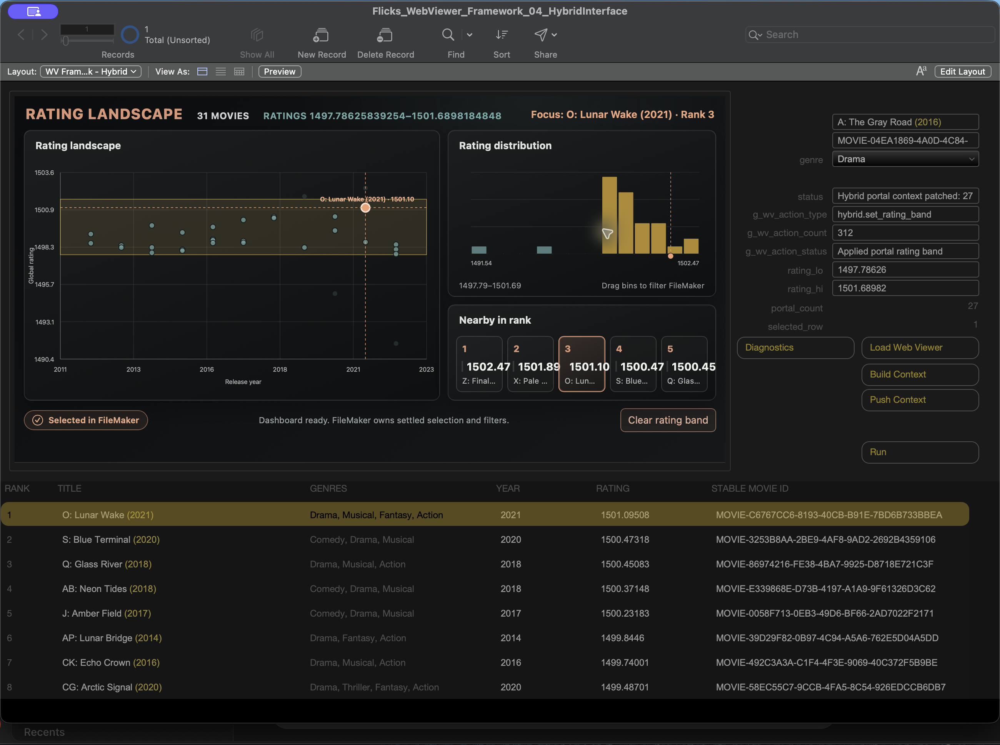

# Beyond the Web Viewer Blob: The Prompt Thickens

## Working With an AI Co-Developer

<aside class="article-resources" aria-label="Article files">
  <a class="article-resources__repository" href="https://github.com/LonCook/filemaker-articles/tree/main/filemaker-web-viewer-series/articles/part-04-the-prompt-thickens">
    
    <span>View this article's files on GitHub</span>
  </a>
  <a class="article-resources__download" href="https://github.com/LonCook/filemaker-articles/raw/refs/heads/main/filemaker-web-viewer-series/articles/part-04-the-prompt-thickens/demo/Flicks_WebViewer_Framework_04_HybridInterface.fmp12" download>
    
    <span>Download the demo file: Flicks_WebViewer_Framework_04_HybridInterface.fmp12</span>
  </a>
</aside>

The first three parts built the framework we have used throughout this series: FileMaker shapes documented context, JavaScript renders it, user intent returns through `WV.sendAction`, and FileMaker remains authoritative.

That framework was itself co-developed with the aid of AI. Until now, though, the series has concentrated on the resulting architecture rather than the development process behind it. This installment slows that process down.

We will extend the framework into the promised visual payoff: a rating landscape, an interactive rating distribution, a nearby-in-rank comparison, and a native FileMaker portal behaving as one interface. The richer interface is also our case study. The question is not whether AI can generate a dashboard. It is whether an AI co-developer can extend an established FileMaker/Web Viewer system without losing the architecture that made the extension possible.

AI can produce a great deal of plausible code quickly. Plausible is useful. It is not the same as correct, integrated, or accepted. The work still needs a human-owned purpose, current source, explicit contracts, a review boundary, evidence from the right environment, and a definition of done that does not become more accommodating merely because the output has arrived.

The method used here has seven parts:

1. Define the job before prompting.
2. Supply the current source and contracts.
3. Define acceptance and where the AI must stop.
4. Constrain the requested change.
5. Review the output as a proposal.
6. Turn observed failure into the next revision.
7. Require native FileMaker evidence before acceptance.

The first four are not four successive conversations. They are the pieces assembled into one initial prompt: the job, the source and contracts, the acceptance tests and stop line, and the exact requested change. Review produces the next prompt only when the evidence calls for a revision.

The hybrid interface is the case study. The method is the article.

## 1. Define The Job Before Prompting

“Build a dashboard” leaves the important decisions conveniently unattended.

Before requesting code, I wrote a human brief describing what the interface had to do. The visible payoff was specific:

- plot every FileMaker-shaped movie by release year and global rating;
- show the FileMaker-owned selected movie across the visualization;
- let the user choose and clear a contiguous rating band;
- show the same movie scope in a native FileMaker portal;
- let either surface report movie selection;
- return accepted selection and band state to both surfaces.

The brief also assigned ownership:

> JavaScript may retain hover, drag, animation, and in-flight presentation state. JavaScript may not retain authoritative selected movie, rating band, native found set, or acknowledgement state.

That sentence does more work than a paragraph about colors or transitions. It tells generated code what it is allowed to remember and, more importantly, what it is not allowed to decide.

FileMaker owns:

- the ordered movie scope;
- the selected stable movie id;
- the rating band;
- validation of incoming actions;
- the context returned as acknowledgement.

JavaScript owns:

- the rating landscape, distribution, and rank-neighborhood presentation;
- pointer and keyboard interaction;
- transient hover and drag previews;
- narrow reports of user intent through the existing bridge.

This is the same custody arrangement established earlier in the series. A larger visualization does not require a new constitution.

## 2. Supply Current Source And Contracts

Before making the request, I saved a compact source packet in the project directory—or, where the source already existed there, identified its current location. The prompt pointed to those files by path; they did not all need to be pasted into or uploaded with the request.

The packet contained:

- a fresh DDR and Save as XML export from the cumulative demo;
- the existing page, renderer, and public action-bridge library modules;
- the current FileMaker context-builder and action-handler scripts exposed by the exports;
- representative context and action JSON;
- native FileMaker screenshots in Browse and Layout modes.

The library modules had already been developed with AI assistance during the earlier work. Their current source supplied the real module-header templates and showed how FileMaker assembles a Web Viewer from named modules in dependency order. The prompt made the intent explicit: follow those headers, declare exact dependencies and exports, and add the new work to the existing assembly rather than inventing another loader. The context builder and action handler were not library files; they were FileMaker scripts whose current definitions and conventions also had to be preserved.

The two native screenshot modes supplied different evidence. Browse mode showed the interface and behavior the user could actually see. Layout mode showed the surrounding FileMaker context: object names, bindings, placement, and the geometry the new work had to inhabit. Neither replaced the DDR, XML export, or exact source, but both made those exports much easier to interpret correctly.

The initial request pointed the AI to the project packet and named the relevant files. Source stayed in the project directory rather than being pasted wholesale into the conversation, but the prompt did not outsource its instructions to those files. It restated the job, governing contracts, acceptance criteria, stop line, requested change, and delivery format under visible headings. A reader can therefore see the method in the prompt itself; the [complete human brief](https://github.com/LonCook/filemaker-articles/blob/main/filemaker-web-viewer-series/articles/part-04-the-prompt-thickens/ai-workflow/01-human-brief.md) and [context manifest](https://github.com/LonCook/filemaker-articles/blob/main/filemaker-web-viewer-series/articles/part-04-the-prompt-thickens/ai-workflow/02-context-manifest.md) supply the deeper source record.

The complete initial and revision prompts appear below, unabridged, and are also preserved as [the initial prompt](https://github.com/LonCook/filemaker-articles/blob/main/filemaker-web-viewer-series/articles/part-04-the-prompt-thickens/ai-workflow/03-initial-prompt.md) and [the evidence-based revision prompt](https://github.com/LonCook/filemaker-articles/blob/main/filemaker-web-viewer-series/articles/part-04-the-prompt-thickens/ai-workflow/07-revision-prompt.md) in the repository. They are the complete prompts for those two bounded passes, not a claim that the entire later redesign and FileMaker integration happened in two messages; the [workflow packet](https://github.com/LonCook/filemaker-articles/tree/main/filemaker-web-viewer-series/articles/part-04-the-prompt-thickens/ai-workflow) preserves those later stages separately.

This distinction matters when working with AI. A screenshot can describe appearance. It cannot establish the current schema, script names, module header, dependency order, action contract, or state ownership. Memory is not better merely because it has been formatted as a prompt.

## 3. Define Acceptance—And Where The AI Must Stop

This was still preparation for the initial prompt. The acceptance requirements and stop line went into that same request alongside the brief, source paths, and architectural contracts. They were not invented later as a review rubric.

The contract says what the implementation must preserve. Acceptance tests say what must be proven. Stop lines say what the AI is authorized to change while getting there.

For this interface, acceptance meant more than producing a convincing chart:

- selecting a movie in the Web Viewer reports its stable `movie_id` through `WV.sendAction`;
- FileMaker validates that id, updates the authoritative selection, and returns acknowledged context;
- selecting a native portal row follows the inverse path and produces the same synchronized result;
- dragging across several histogram bins reports one contiguous rating range;
- clearing that range restores the full FileMaker-owned scope;
- null or empty ratings never become a synthetic zero;
- browser testing proves browser behavior, while native integration is accepted only in FileMaker.

Declaring those tests in advance prevents “done” from being quietly redefined around whichever parts of the generated result happen to work.

The stop line answered a different question: how far could the AI go before returning control?

> Produce proposed modules `43` and `44`. Do not modify FileMaker scripts yet.

That boundary matters because a coding agent can encounter any number of adjacent things it could plausibly improve. Without a stop line, a renderer request can spread through the bridge, scripts, schema, relationships, and deployment machinery. Each change may sound reasonable; together they amount to an architectural decision no one delegated.

Acceptance tests define the destination. Stop lines define the permitted territory.

Failure does not expand that territory. When the pointer-drag test failed, it authorized investigation and a bounded correction to pointer handling. It did not authorize a new action contract, different module indexes, unrelated FileMaker changes, or reconsideration of decisions that had already passed review.

## 4. Constrain The Requested Change

The first three portions establish the purpose, governing architecture, and evidence required for acceptance. The requested-change portion turns those decisions into a concrete delivery contract: exactly which artifacts the AI should produce, how complete they must be, and where its authority ends. That keeps a bounded module proposal from quietly becoming a FileMaker redesign before the proposal has even been reviewed.

That portion of the prompt was short:

```text
## 4. Requested Change And Delivery

Return:

1. The complete source for module `43`, `wv.page.hybrid.rating.html`.
2. The complete source for module `44`, `wv.renderer.hybrid.rating.js`.
3. A compact dependency and export summary for each module.
4. A compact explanation of how the proposal preserves FileMaker ownership
   and uses `WV.sendAction`.

Do not return partial patches. Do not broaden the requested change.
```

Here is the full prompt, unabridged:

```text
# Initial Prompt: Propose The Hybrid Rating Modules

## 1. Job

Extend the existing FileMaker/Web Viewer framework with an accessible
rating distribution that works alongside the native FileMaker record
surface.

The two surfaces must behave as views of the same FileMaker-owned movie
scope, selected movie, and rating band. JavaScript presents the
visualization and reports user intent. FileMaker validates that intent,
changes authoritative state, and returns acknowledgement context.

Propose only the new page and renderer modules in this pass. Do not modify
FileMaker scripts yet.

## 2. Current Source And Contracts

Inspect these project files before proposing code:

- `01-human-brief.md` — human-owned purpose, behavior, accessibility
  requirements, and boundaries.
- `02-context-manifest.md` — exact current exports, accepted modules,
  FileMaker scripts, representative JSON, dependencies, and deliberate
  exclusions.
- Every source file named by the manifest. Current source outranks
  inference or memory.

Preserve the existing architecture:

- FileMaker supplies `ranked_view.rows`, `ranked_view.selected_movie_id`,
  `ranked_view.native_found_count`, and `ranked_view.rating_band`.
- Each row uses its stable `movie_id` and supplied display, rating, rank,
  and selected values.
- JavaScript sends intent only through inherited module `25`,
  `WV.sendAction`.
- Allowed actions are `hybrid.select_movie`, `hybrid.set_rating_band`, and
  `hybrid.clear_rating_band`.
- JavaScript may retain hover, drag, animation, and in-flight preview state.
- JavaScript may not retain authoritative selected-movie, rating-band,
  found-set, or acknowledgement state. Returned FileMaker context wins on
  every render.
- An empty `ranked_view.rows` array is an empty state. Do not invent
  fallback movies or production-looking data.

Follow the module conventions visible in the supplied source:

- New module `43`: `wv.page.hybrid.rating.html`.
- New module `44`: `wv.renderer.hybrid.rating.js`.
- Preserve the established module-header format.
- Declare exact dependencies and exports.
- Add the modules to the existing assembly model; do not invent another
  loader or bridge.

Do not import production module `66`, movers, layered surfaces, camera
behavior, production reducers, synthetic defaults, or cache/deployment
machinery.

## 3. Acceptance Criteria And Stop Line

The proposal must satisfy these acceptance criteria:

1. Render an accessible SVG rating histogram derived honestly from the
   supplied rows.
2. Show the movie identified by FileMaker as selected with a visible focus
   marker.
3. Support one contiguous rating-band selection through pointer and keyboard
   interaction.
4. Send movie selection and rating-band intent only through `WV.sendAction`
   using the three allowed actions.
5. Wait for returned FileMaker context before treating selection or band
   state as accepted.
6. Render loading, empty, error, selected, and filtered states legibly.
7. Reject absent numeric values rather than coercing them into synthetic
   zeroes.
8. Include no direct `FileMaker.PerformScript` call and no browser-owned
   authoritative state.
9. Preserve exact module dependencies, exports, action names, and stable
   movie identifiers.
10. Provide complete source that can be reviewed in the browser harness
    before FileMaker integration.

Stop after returning the two proposed modules. Do not create or modify
FileMaker scripts, schema, relationships, layouts, or deployment machinery.
The proposal will be reviewed before integration.

## 4. Requested Change And Delivery

Return:

1. The complete source for module `43`, `wv.page.hybrid.rating.html`.
2. The complete source for module `44`, `wv.renderer.hybrid.rating.js`.
3. A compact dependency and export summary for each module.
4. A compact explanation of how the proposal preserves FileMaker ownership
   and uses `WV.sendAction`.

Do not return partial patches. Do not broaden the requested change.
```

Those are not ornamental prompt details. Each one closes a plausible route by which a useful-looking renderer could violate the existing framework.

The stop instruction matters too. The first output was allowed to propose renderer modules. It was not authorized to redesign FileMaker scripts, add schema, or roam through the cumulative demo improving things it had recently noticed.

## 5. Review The Output As A Proposal

The AI returned modules `43` and `44` with the expected division:

| Index | Module | Job |
| ---: | --- | --- |
| `43` | `wv.page.hybrid.rating.html` | assemble the page and loading surface |
| `44` | `wv.renderer.hybrid.rating.js` | render the visualization and report selection and band intent |

The [untouched initial code output](https://github.com/LonCook/filemaker-articles/tree/main/filemaker-web-viewer-series/articles/part-04-the-prompt-thickens/ai-workflow/04-initial-output) is preserved beside the prompt that produced it. Keeping that first answer matters: otherwise, later corrections can quietly erase the evidence that explains why a revision was needed.

Several important checks passed:

- the dependencies and exports were declared;
- rows came only from `ranked_view.rows`;
- stable `movie_id` values were used for actions;
- empty input remained visibly empty;
- outbound actions used `WV.sendAction`;
- no production router, reducer, or synthetic movies appeared;
- returned context remained authoritative.

That did not make the proposal accepted.

The browser harness exposed a pointer defect. In this abridged excerpt, the initial code captured the pointer on the starting histogram rectangle:

```js
rect.addEventListener("pointerdown", function (event) {
  local.dragStart = index;
  local.dragEnd = index;
  if (rect.setPointerCapture) rect.setPointerCapture(event.pointerId);
});
// ...
rect.addEventListener("pointerenter", function () {
  if (local.dragStart >= 0) local.dragEnd = index;
});
```

Dragging across several bins still emitted the starting bin alone. Pointer capture kept events on the first rectangle while range growth depended on entering its siblings. The code was internally tidy and externally wrong.

Review found two quieter defects as well. `Number(null)` and `Number("")` both produce zero, so incomplete returned state could masquerade as a valid rating. Inclusive overlap at shared bin edges could also highlight an adjacent bin that was not actually inside the acknowledged range.

These findings came from three different review questions:

1. Does the code obey the contract?
2. Does the code behave correctly in the browser?
3. Does its treatment of values match the data contract at edge cases?

“The code runs” answers none of them particularly well.

## 6. Turn Failure Into The Revision

The revision request contained the observed behavior, the failed layer, the relevant source mechanism, the required correction, and the boundaries that must remain unchanged. Here it is in full:

```text
# Revision Prompt

Revise the initial module `44` proposal using this observed evidence.

Observed browser-harness failure:

- Drag began in the first histogram bin and crossed several visible bars.
- Outbound action was `hybrid.set_rating_band`, but the bounds covered only the starting bin: `1496.31`–`1496.535625`.
- Keyboard range selection worked.
- Source inspection shows pointer capture is set on the starting `rect`, while range growth depends on `pointerenter` firing on sibling rectangles.

Required correction:

1. Track pointer drag at the chart level.
2. Convert the current pointer x-coordinate to a clamped bin index using the SVG viewBox/chart bounds.
3. Keep the starting bin as transient state; update the preview from chart-level pointer movement.
4. Commit one narrow `hybrid.set_rating_band` action on pointer release.
5. Preserve FileMaker ownership; do not mark the preview authoritative or synthesize acknowledgement.
6. Reject null, undefined, and empty-string numeric values before calling `Number(...)`.
7. Make acknowledged band/bin overlap consistent at shared edges.
8. Do not change the input contract, action names, module indexes, dependency closure, or stop lines.

Return the reviewed module source plus a compact diff explanation. Do not modify FileMaker scripts.
```

This is a much better revision request than “the drag is broken.” It identifies what the evidence proved without prescribing an unrelated rewrite.

The corrected code moved capture and movement to the chart; this excerpt omits unrelated keyboard and rendering code:

```js
rect.addEventListener("pointerdown", function (event) {
  local.dragStart = index;
  local.dragEnd = index;
  if (chart.setPointerCapture) chart.setPointerCapture(event.pointerId);
  // ...
});
// ...
chart.addEventListener("pointermove", function (event) {
  if (local.dragStart < 0) return;
  local.dragEnd = pointerBin(event);
  updatePreview();
});
// ...
chart.addEventListener("pointerup", function (event) {
  if (local.dragStart < 0) return;
  local.dragEnd = pointerBin(event);
  commitRange(local.dragStart, local.dragEnd);
  // ...
});
```

The numeric helper now rejects null and empty input before conversion, and acknowledged band overlap no longer double-counts shared edges.

The repository preserves the [complete reviewed JavaScript change](https://github.com/LonCook/filemaker-articles/tree/main/filemaker-web-viewer-series/articles/part-04-the-prompt-thickens/ai-workflow/08-final-change), not just these excerpts.

The revision preserved everything already accepted. It did not rename actions, change module indexes, import production state, or give JavaScript authority it had not previously possessed. A useful revision narrows the defect. It does not reopen the whole project because the prompt has regained access to a keyboard.

## Human Review Still Owns The Payoff

The corrected histogram satisfied the initial interaction brief. It did not yet provide enough visual payoff for this installment.

That was a product decision, not a code defect. The target expanded into three linked views:

1. A rating landscape showing year against global rating.
2. The accessible rating distribution and contiguous band control.
3. A nearby-in-rank comparison centered on FileMaker’s selected movie.

The revised renderer reused the same row contract and the same three actions. No new schema or action router was required. The visual scope grew; the ownership boundary did not.

That expanded renderer proposal and its supporting files are preserved as the [dashboard redesign output](https://github.com/LonCook/filemaker-articles/tree/main/filemaker-web-viewer-series/articles/part-04-the-prompt-thickens/ai-workflow/11-redesign-output).


This is another part of working with an AI co-developer: generated code can satisfy its prompt and still fail the larger human purpose. Contract compliance is necessary. It is not a substitute for taste, priorities, or judgment about whether the result was worth building.

## 7. Require Evidence From The Right Environment

The browser harness was useful for:

- SVG geometry and responsive layout;
- pointer and keyboard behavior;
- empty, selected, and acknowledged states;
- outbound action-envelope capture;
- checking that the renderer contained no direct FileMaker bridge call.

It could not prove:

- native layout context;
- FileMaker portal behavior;
- script validation;
- authoritative selection and rating-band state;
- acknowledgement through the real Web Viewer;
- whether the loaded viewer remained present while native state changed.

Those claims required the FileMaker target.

The final `WV Framework - Hybrid` layout uses a stable one-record `SOLUTION__all` context. `wv_main` remains on that record while a native `MOVIE_GLOBAL_RATING` portal displays the FileMaker-owned movie scope. An ordered list of stable ids drives portal membership. `FOCUS::g_wv_demo_movie_id` owns selection, and the rating globals own the acknowledged band.

A portal-row click and a Web Viewer selection both update that FileMaker state, patch the context, and push acknowledgement. The two surfaces do not synchronize directly with one another. They synchronize with FileMaker.

```text
Native portal intent ─┐
                      ├─> FileMaker-owned state
Web Viewer intent ────┘            │
                                   ├─> native portal treatment
                                   └─> acknowledged Web Viewer context
```

### Inventory The FileMaker Deliverables

The AI-generated work did not stop at JavaScript. Once the proposed modules were ready for integration, the AI also produced FileMaker script steps, layout objects, and one Web Viewer address calculation. FileMaker transports all of these through text or FMXML, but they do not share a paste target. FileMaker is particular about this distinction and characteristically quiet when you get it wrong.

The repository’s [FileMaker artifact index](https://github.com/LonCook/filemaker-articles/blob/main/filemaker-web-viewer-series/articles/part-04-the-prompt-thickens/fmxmlsnippets/README.md) separates the current portal installation from the historical repair variants. The current instructions are divided into two passes:

1. The [portal conversion instructions](https://github.com/LonCook/filemaker-articles/blob/main/filemaker-web-viewer-series/articles/part-04-the-prompt-thickens/fmxmlsnippets/2026-08-17-portal-repair-install.md) change the layout context, install the portal, replace the primary interaction scripts, and define the native validation sequence.
2. The [portal-metrics v2 instructions](https://github.com/LonCook/filemaker-articles/blob/main/filemaker-web-viewer-series/articles/part-04-the-prompt-thickens/source/build-notes/2026-08-18-portal-metrics-v2-install.md) install the corrected metric objects and the two scripts that refresh only those objects.

The accepted **script-step snippets** use `<fmxmlsnippet type="FMObjectList">`. Each is pasted into Script Workspace as the complete body of an existing script. An `FMObjectList` does not become a layout object through optimism.

| FileMaker script | Generated snippet | Responsibility |
| --- | --- | --- |
| `WV__Demo_Build_Context` | [`WV__Demo_Build_Context_Portal_Metrics_v2.fmxmlsnippet`](https://github.com/LonCook/filemaker-articles/blob/main/filemaker-web-viewer-series/articles/part-04-the-prompt-thickens/fmxmlsnippets/WV__Demo_Build_Context_Portal_Metrics_v2.fmxmlsnippet) | Build the portal-backed context and calculate the private portal metrics. |
| `WV__Demo_Apply_Hybrid_Context` | [`WV__Demo_Apply_Hybrid_Context_Portal_Metrics_v2.fmxmlsnippet`](https://github.com/LonCook/filemaker-articles/blob/main/filemaker-web-viewer-series/articles/part-04-the-prompt-thickens/fmxmlsnippets/WV__Demo_Apply_Hybrid_Context_Portal_Metrics_v2.fmxmlsnippet) | Apply acknowledged state and refresh only the two metric objects. |
| `WV__Demo_Handle_Action` | [`WV__Demo_Handle_Action_Portal.fmxmlsnippet`](https://github.com/LonCook/filemaker-articles/blob/main/filemaker-web-viewer-series/articles/part-04-the-prompt-thickens/fmxmlsnippets/WV__Demo_Handle_Action_Portal.fmxmlsnippet) | Validate and handle the three `hybrid.*` actions. |
| `WV__Demo_Select_Native_Row` | [`WV__Demo_Select_Native_Row_Portal.fmxmlsnippet`](https://github.com/LonCook/filemaker-articles/blob/main/filemaker-web-viewer-series/articles/part-04-the-prompt-thickens/fmxmlsnippets/WV__Demo_Select_Native_Row_Portal.fmxmlsnippet) | Turn a portal-row click into FileMaker-owned selection and acknowledgement. |
| `WV__Demo_Run_All` | [`WV__Demo_Run_All_Portal_v2.fmxmlsnippet`](https://github.com/LonCook/filemaker-articles/blob/main/filemaker-web-viewer-series/articles/part-04-the-prompt-thickens/fmxmlsnippets/WV__Demo_Run_All_Portal_v2.fmxmlsnippet) | Build context, explicitly load module `43` when Run is requested, and push context. |
| `. webviewer . load ( index ; -object_name )` | [`WebViewer_Load_Persistent_URL.fmxmlsnippet`](https://github.com/LonCook/filemaker-articles/blob/main/filemaker-web-viewer-series/articles/part-04-the-prompt-thickens/fmxmlsnippets/WebViewer_Load_Persistent_URL.fmxmlsnippet) | Preserve the rendered viewer URL so interaction-time context changes do not require a reload. |

The accepted **layout-object snippets** use `<fmxmlsnippet type="LayoutObjectList">`. They are pasted in Layout Mode, with the correct part active and no existing object selected:

| Generated snippet | Layout content |
| --- | --- |
| [`WV_Framework_Hybrid_Portal_Objects.fmxmlsnippet`](https://github.com/LonCook/filemaker-articles/blob/main/filemaker-web-viewer-series/articles/part-04-the-prompt-thickens/fmxmlsnippets/WV_Framework_Hybrid_Portal_Objects.fmxmlsnippet) | Portal, headings, row fields, full-row selection button, and selected-row conditional formatting. |
| [`WV_Framework_Hybrid_Portal_Metrics_v2.fmxmlsnippet`](https://github.com/LonCook/filemaker-articles/blob/main/filemaker-web-viewer-series/articles/part-04-the-prompt-thickens/fmxmlsnippets/WV_Framework_Hybrid_Portal_Metrics_v2.fmxmlsnippet) | The named `portal_count` and `selected_row` merge-calculation objects used by targeted refresh. |

Finally, [`wv_main_persistent_address.calc.txt`](https://github.com/LonCook/filemaker-articles/blob/main/filemaker-web-viewer-series/articles/part-04-the-prompt-thickens/fmxmlsnippets/wv_main_persistent_address.calc.txt) is calculation text for the Web Viewer setup dialog. It is not pasted into a script or onto a layout.

<style>
  .article-code-callout {
    --callout-bg: #f6f8fa;
    --callout-border: #d0d7de;
    --callout-text: #24292f;
    --callout-strong: #1f2328;
    --callout-accent: #9a6700;
    color-scheme: light dark;
    margin: 1.75rem 0;
    padding: 1.25rem 1.4rem;
    border: 1px solid var(--callout-border);
    border-radius: 8px;
    background: var(--callout-bg);
    color: var(--callout-text);
    font-family: ui-monospace, SFMono-Regular, Menlo, Monaco, Consolas, "Liberation Mono", monospace;
    font-size: .94em;
    line-height: 1.58;
    box-shadow: inset 4px 0 0 var(--callout-accent);
  }
  .article-code-callout h4 {
    margin: 0 0 1rem;
    color: var(--callout-accent);
    font-family: inherit;
    font-size: 1.08em;
  }
  .article-code-callout p { margin: .8rem 0; }
  .article-code-callout p:last-child { margin-bottom: 0; }
  .article-code-callout strong { color: var(--callout-strong); }
  .article-code-callout a,
  .article-code-callout code { color: var(--callout-accent); }
  @media (prefers-color-scheme: dark) {
    .article-code-callout {
      --callout-bg: #161b22;
      --callout-border: #30363d;
      --callout-text: #c9d1d9;
      --callout-strong: #f0f3f6;
      --callout-accent: #f0c14b;
    }
  }
</style>
<aside class="article-code-callout" aria-labelledby="fmxml-clipboard-heading">
  <h4 id="fmxml-clipboard-heading">Getting FMXML Onto The Clipboard</h4>
  <p>An FMXML file in Git is ordinary XML text. FileMaker does not paste that text as script steps or layout objects unless the clipboard also carries FileMaker’s internal object flavor. There are three practical ways to cross that boundary.</p>
  <p><strong>Let the AI agent load the clipboard directly.</strong> During this build, Codex generated each snippet and placed it on the clipboard in FileMaker’s expected format. I could paste it immediately into Script Workspace or Layout Mode. No plug-in or intervening clipboard utility was required. When the agent can write the FileMaker clipboard flavor itself, adding another conversion step would mostly give us another conversion step.</p>
  <p><strong>Use the MBS FileMaker Plugin.</strong> With the <a href="https://www.monkeybreadsoftware.com/filemaker/SyntaxColoring/43-ClipboardConverter.shtml">MBS automatic Clipboard Converter</a> installed and enabled, valid FMXML copied as text from Git or an editor is converted into the internal FileMaker clipboard format when FileMaker comes to the foreground. An older or explicitly scripted workflow can instead call <a href="https://www.mbsplugins.eu/ClipboardSetFileMakerData.shtml"><code>Clipboard.SetFileMakerData</code></a>. MBS is an installation aid in this workflow; the completed demo does not require it at runtime.</p>
  <p><strong>Use the FM Clipboard Tool.</strong> A dedicated <a href="https://filemakerhacks.com/2026/05/31/fm-clipboard-tool-and-fmxml/">FM Clipboard Tool</a> can accept the XML text and place the corresponding FileMaker object data on the clipboard. This provides the same bridge without making MBS part of the workflow.</p>
  <p>Whichever route loads the clipboard, the paste target still matters: <code>FMObjectList</code> belongs in Script Workspace, <code>LayoutObjectList</code> belongs in Layout Mode, and calculation text belongs in its specified calculation dialog. The clipboard may now speak FileMaker; it has not acquired judgment.</p>
</aside>

Earlier native-list, `ROWID_List`, portal, and first-pass metrics variants remain in the repository as development evidence. The artifact index marks them as historical so a reader does not mistake every surviving file for another required installation step.

All of these proposals were manually pasted and reviewed in FileMaker. The XML can be impeccable while the installation is wrong. Syntax has never been burdened with situational awareness: it cannot tell us that an object landed in the wrong place, that a reference failed to resolve, or that the native interaction does not work.

The fresh DDR and Save as XML export verify the installed layout context, portal, object names, script histories, merge calculations, and interaction-path structure.

The final native captures show:

- a clean Run with the complete hybrid interface;
- portal-row selection acknowledged in the visualization;
- Web Viewer dot selection acknowledged in the portal;
- a rating-band change reflected in both surfaces.







Each capture comes from the actual FileMaker target. A screenshot from the browser harness would prove only that the browser harness can take screenshots. It has already demonstrated that talent.

## What Remains Human-Owned

AI helped produce and revise the modules. It helped compare outputs with source exports, assemble pasteable FileMaker XML, and narrow defects from recorded evidence.

It did not own:

- the purpose of the visualization;
- the division of responsibility between FileMaker and JavaScript;
- the allowed data and action contracts;
- authorization to change schema or scripts;
- the decision that the first visual payoff was insufficient;
- the definition of native acceptance;
- the decision to keep generated code in the maintained system.

These are not the chores left over after AI development. They are the development decisions that make AI assistance useful.

## A Reusable AI Co-Development Checklist

For a FileMaker Web Viewer change, I would use the same sequence again.

### Before the prompt

- Define the visible job and why it belongs in a Web Viewer.
- Assign authoritative state explicitly.
- Export and inspect current FileMaker and module source.
- Identify the exact allowed change boundary.
- Write acceptance tests and stop lines.

### In the prompt

- Name the supplied inputs and expected outputs.
- Provide representative context and action messages.
- Require the established public bridge.
- Name forbidden dependencies and authority.
- Ask for a proposal at the smallest useful integration boundary.

### During review

- Compare dependencies, fields, scripts, and APIs with current source.
- Check ownership, not merely syntax.
- Exercise empty, loading, selected, filtered, and error states.
- Preserve the untouched initial output and record accepted and rejected findings.

### During revision

- Report observed behavior and expected behavior.
- Identify the failed layer.
- Supply the relevant source and evidence.
- Preserve everything already accepted.
- Stop broad rewrites from entering through a narrow defect.

### Before acceptance

- Use browser evidence only for browser claims.
- Test layout, bridge, records, validation, and acknowledgement in FileMaker.
- Reconcile final source exports with the article and build materials.
- Do not call a passing component test a completed interface.

## Takeaway

AI accelerated the implementation. The framework made the output inspectable. The contract made it reviewable. Evidence made revision specific. FileMaker testing decided whether the integrated result was real.

That is the lesson:

> AI accelerates implementation only when purpose, authority, review, and acceptance remain explicit. Otherwise, it accelerates plausible rework.

The hybrid rating interface is the payoff, but it is also evidence for a more reusable practice. Give AI a bounded job, current source, and a place to land. Review what arrives as a proposal. Feed failures back as evidence. Keep application authority where it belongs.

Earlier in the series, we deliberately kept cache rebuilds, viewer loading, and context pushes exposed while the framework was still being developed. The visible machinery was both a teaching surface and a debugging surface. Now that the framework and the co-development process are understood, the series concludes by automating that routine machinery without turning it back into magic: cache versions, dirty state, loaded-viewer tracking, bounded recovery, deployment, and rollback. We can finally conceal some of how the hot dogs are made. The recipe, ownership, and failure paths remain inspectable.
